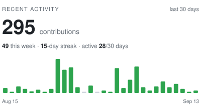

  <strong>BCompSc (Machine Learning) @ The University of Queensland</strong> 
  Brisbane, Australia &nbsp;·&nbsp; he/him

AI Agents &nbsp;·&nbsp; Memory &nbsp;·&nbsp; Retrieval

<table>
<tr>
<td width="62%" valign="top">

<h2>About</h2>

  I'm a computer science undergraduate majoring in Machine Learning
  at The University of Queensland.

  I'm particularly interested in <strong>AI agents, long-term memory,
  and knowledge representation</strong>, and how these connect with NLP,
  information retrieval, and sequential decision-making.

<h2>Currently</h2>

<ul>
  <li>🌱 Studying deep learning, NLP, pattern recognition, and AI planning</li>
  <li>📖 Exploring information retrieval and reinforcement learning</li>
  <li>🧩 Connecting mathematical foundations with hands-on implementation</li>
</ul>

</td>
<td width="38%" valign="top">

<h2>Activity</h2>

<picture>
  <source media="(prefers-color-scheme: dark)" srcset="assets/activity-dark.svg" />
  
</picture>

 

  
  

yes, the anime girls are staying.

</td>
</tr>
</table>

## Tools & Technologies

**ML & Data**

**Development & Tooling**

More tools & technologies

**Languages & markup:** JavaScript · PHP · R · HTML · CSS  
**Frameworks & libraries:** Next.js · Three.js · Laravel  
**Infrastructure:** Docker · MySQL · Cloudflare Workers

